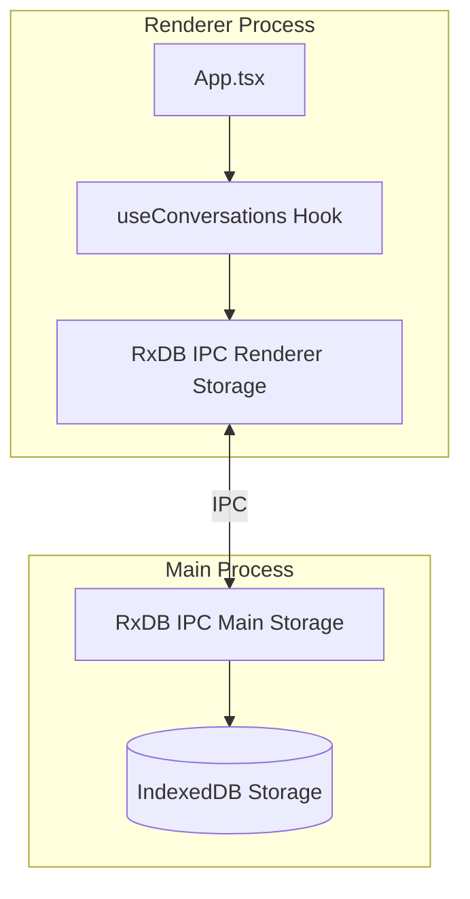
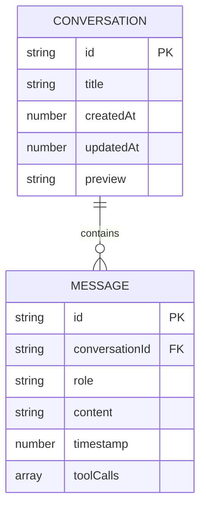
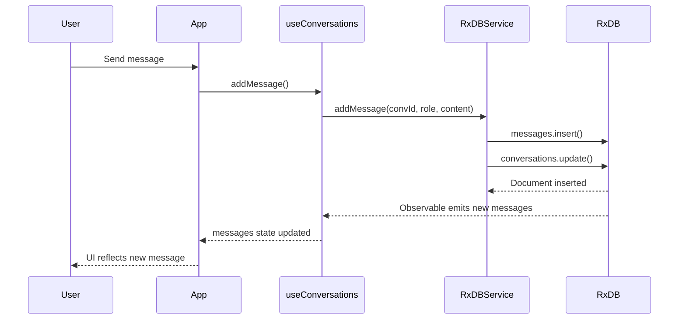

# Design Document: Chat Persistence with RxDB

## Overview

This design implements persistent chat storage for GoatedApp using RxDB, a reactive NoSQL database optimized for JavaScript applications. The architecture leverages RxDB's Electron plugin to run storage in the main process while allowing the renderer process to interact with the database through IPC communication. This provides real-time reactivity, offline-first capabilities, and seamless integration with React.

## Architecture



The architecture follows RxDB's recommended Electron pattern:
1. **Main Process**: Exposes RxStorage via IPC using `exposeIpcMainRxStorage`
2. **Renderer Process**: Consumes storage via `getRxStorageIpcRenderer` and creates the RxDatabase
3. **React Integration**: Custom hooks provide reactive subscriptions to database changes

## Components and Interfaces

### Database Schema Definitions

```typescript
// src/renderer/db/schemas.ts

import { RxJsonSchema } from 'rxdb';

export interface ConversationDocument {
  id: string;
  title: string;
  createdAt: number;
  updatedAt: number;
  preview: string;
}

export interface MessageDocument {
  id: string;
  conversationId: string;
  role: 'user' | 'assistant' | 'tool';
  content: string;
  timestamp: number;
  toolCalls?: ToolCallData[];
}

export interface ToolCallData {
  id: string;
  name: string;
  arguments: string;
  status: 'pending' | 'success' | 'error';
  result?: string;
}

export const conversationSchema: RxJsonSchema<ConversationDocument> = {
  version: 0,
  title: 'conversation schema',
  primaryKey: 'id',
  type: 'object',
  properties: {
    id: { type: 'string', maxLength: 36 },
    title: { type: 'string', maxLength: 200 },
    createdAt: { type: 'number' },
    updatedAt: { type: 'number' },
    preview: { type: 'string', maxLength: 100 }
  },
  required: ['id', 'title', 'createdAt', 'updatedAt', 'preview'],
  indexes: ['updatedAt']
};

export const messageSchema: RxJsonSchema<MessageDocument> = {
  version: 0,
  title: 'message schema',
  primaryKey: 'id',
  type: 'object',
  properties: {
    id: { type: 'string', maxLength: 36 },
    conversationId: { type: 'string', maxLength: 36 },
    role: { type: 'string', enum: ['user', 'assistant', 'tool'], maxLength: 10 },
    content: { type: 'string' },
    timestamp: { type: 'number' },
    toolCalls: {
      type: 'array',
      items: {
        type: 'object',
        properties: {
          id: { type: 'string' },
          name: { type: 'string' },
          arguments: { type: 'string' },
          status: { type: 'string', enum: ['pending', 'success', 'error'] },
          result: { type: 'string' }
        },
        required: ['id', 'name', 'arguments', 'status']
      }
    }
  },
  required: ['id', 'conversationId', 'role', 'content', 'timestamp'],
  indexes: ['conversationId', 'timestamp', ['conversationId', 'timestamp']]
};
```

### Main Process Storage Setup

```typescript
// src/main/db/setupStorage.ts

import { exposeIpcMainRxStorage } from 'rxdb/plugins/electron';
import { getRxStorageIndexedDB } from 'rxdb/plugins/storage-indexeddb';
import { ipcMain } from 'electron';

export function setupMainProcessStorage(): void {
  exposeIpcMainRxStorage({
    key: 'goated-app-storage',
    storage: getRxStorageIndexedDB(),
    ipcMain
  });
}
```

### Renderer Process Database Service

```typescript
// src/renderer/db/database.ts

import { createRxDatabase, RxDatabase, RxCollection } from 'rxdb';
import { getRxStorageIpcRenderer } from 'rxdb/plugins/electron';
import { conversationSchema, messageSchema, ConversationDocument, MessageDocument } from './schemas';

export type ConversationCollection = RxCollection<ConversationDocument>;
export type MessageCollection = RxCollection<MessageDocument>;

export interface DatabaseCollections {
  conversations: ConversationCollection;
  messages: MessageCollection;
}

export type GoatedDatabase = RxDatabase<DatabaseCollections>;

let dbInstance: GoatedDatabase | null = null;

export async function getDatabase(): Promise<GoatedDatabase> {
  if (dbInstance) return dbInstance;

  dbInstance = await createRxDatabase<DatabaseCollections>({
    name: 'goatedapp',
    storage: getRxStorageIpcRenderer({
      key: 'goated-app-storage',
      ipcRenderer: window.electron.ipcRenderer
    })
  });

  await dbInstance.addCollections({
    conversations: { schema: conversationSchema },
    messages: { schema: messageSchema }
  });

  return dbInstance;
}
```

### RxDB Service Interface

```typescript
// src/renderer/db/RxDBService.ts

import { Observable } from 'rxjs';
import { map } from 'rxjs/operators';
import { getDatabase, GoatedDatabase } from './database';
import { ConversationDocument, MessageDocument, ToolCallData } from './schemas';

export class RxDBService {
  private db: GoatedDatabase | null = null;

  async initialize(): Promise<void> {
    this.db = await getDatabase();
  }

  // Conversation operations
  async createConversation(title?: string): Promise<ConversationDocument> {
    const now = Date.now();
    const doc = await this.db!.conversations.insert({
      id: crypto.randomUUID(),
      title: title || 'New Conversation',
      createdAt: now,
      updatedAt: now,
      preview: ''
    });
    return doc.toJSON();
  }

  async deleteConversation(id: string): Promise<void> {
    // Delete all messages first
    await this.db!.messages.find({ selector: { conversationId: id } }).remove();
    // Delete conversation
    await this.db!.conversations.findOne(id).remove();
  }

  async updateConversationTitle(id: string, title: string): Promise<void> {
    await this.db!.conversations.findOne(id).update({
      $set: { title, updatedAt: Date.now() }
    });
  }

  getConversations$(): Observable<ConversationDocument[]> {
    return this.db!.conversations
      .find({ sort: [{ updatedAt: 'desc' }] })
      .$
      .pipe(map(docs => docs.map(d => d.toJSON())));
  }

  // Message operations
  async addMessage(
    conversationId: string,
    role: 'user' | 'assistant' | 'tool',
    content: string,
    toolCalls?: ToolCallData[]
  ): Promise<MessageDocument> {
    const message = await this.db!.messages.insert({
      id: crypto.randomUUID(),
      conversationId,
      role,
      content,
      timestamp: Date.now(),
      toolCalls
    });

    // Update conversation preview and timestamp
    const preview = content.slice(0, 100);
    await this.db!.conversations.findOne(conversationId).update({
      $set: { preview, updatedAt: Date.now() }
    });

    return message.toJSON();
  }

  getMessages$(conversationId: string): Observable<MessageDocument[]> {
    return this.db!.messages
      .find({
        selector: { conversationId },
        sort: [{ timestamp: 'asc' }]
      })
      .$
      .pipe(map(docs => docs.map(d => d.toJSON())));
  }

  // Search operations
  async searchConversations(query: string): Promise<ConversationDocument[]> {
    const lowerQuery = query.toLowerCase();
    const messages = await this.db!.messages.find().exec();
    
    const matchingConversationIds = new Set(
      messages
        .filter(m => m.content.toLowerCase().includes(lowerQuery))
        .map(m => m.conversationId)
    );

    const conversations = await this.db!.conversations.find().exec();
    return conversations
      .filter(c => matchingConversationIds.has(c.id))
      .map(c => c.toJSON());
  }
}

export const rxdbService = new RxDBService();
```

### React Hook for Conversations

```typescript
// src/renderer/hooks/useConversations.ts

import { useState, useEffect, useCallback } from 'react';
import { rxdbService } from '../db/RxDBService';
import { ConversationDocument, MessageDocument } from '../db/schemas';

export function useConversations() {
  const [conversations, setConversations] = useState<ConversationDocument[]>([]);
  const [activeConversationId, setActiveConversationId] = useState<string | null>(null);
  const [messages, setMessages] = useState<MessageDocument[]>([]);
  const [isLoading, setIsLoading] = useState(true);
  const [error, setError] = useState<string | null>(null);

  // Initialize and subscribe to conversations
  useEffect(() => {
    let conversationsSub: { unsubscribe: () => void } | null = null;

    const init = async () => {
      try {
        await rxdbService.initialize();
        conversationsSub = rxdbService.getConversations$().subscribe(convs => {
          setConversations(convs);
          // Auto-select most recent if none selected
          if (!activeConversationId && convs.length > 0) {
            setActiveConversationId(convs[0].id);
          }
          setIsLoading(false);
        });
      } catch (err) {
        setError(err instanceof Error ? err.message : 'Failed to initialize database');
        setIsLoading(false);
      }
    };

    init();
    return () => conversationsSub?.unsubscribe();
  }, []);

  // Subscribe to messages when active conversation changes
  useEffect(() => {
    if (!activeConversationId) {
      setMessages([]);
      return;
    }

    const sub = rxdbService.getMessages$(activeConversationId).subscribe(setMessages);
    return () => sub.unsubscribe();
  }, [activeConversationId]);

  const createConversation = useCallback(async () => {
    const conv = await rxdbService.createConversation();
    setActiveConversationId(conv.id);
    return conv;
  }, []);

  const deleteConversation = useCallback(async (id: string) => {
    await rxdbService.deleteConversation(id);
    if (activeConversationId === id) {
      setActiveConversationId(conversations[0]?.id || null);
    }
  }, [activeConversationId, conversations]);

  const addMessage = useCallback(async (
    role: 'user' | 'assistant' | 'tool',
    content: string,
    toolCalls?: any[]
  ) => {
    if (!activeConversationId) {
      const conv = await createConversation();
      return rxdbService.addMessage(conv.id, role, content, toolCalls);
    }
    return rxdbService.addMessage(activeConversationId, role, content, toolCalls);
  }, [activeConversationId, createConversation]);

  return {
    conversations,
    activeConversationId,
    setActiveConversationId,
    messages,
    isLoading,
    error,
    createConversation,
    deleteConversation,
    addMessage
  };
}
```

## Data Models

### Entity Relationship Diagram



### Data Flow



## Correctness Properties

*A property is a characteristic or behavior that should hold true across all valid executions of a system-essentially, a formal statement about what the system should do. Properties serve as the bridge between human-readable specifications and machine-verifiable correctness guarantees.*


### Property 1: Message Persistence

*For any* valid message (user, assistant, or tool) with any content and optional tool calls, when added via RxDBService.addMessage(), the message SHALL be retrievable from the database with all fields intact.

**Validates: Requirements 1.1, 1.2, 1.4**

### Property 2: Conversation Ordering

*For any* set of conversations with different updatedAt timestamps, when retrieved via getConversations$(), the conversations SHALL be returned in descending order by updatedAt.

**Validates: Requirements 2.1**

### Property 3: Message Retrieval by Conversation

*For any* conversation with N messages, when getMessages$(conversationId) is called, exactly N messages SHALL be returned, all belonging to that conversation, ordered by timestamp ascending.

**Validates: Requirements 2.2**

### Property 4: Reactive Subscription Emission

*For any* database mutation (create conversation, delete conversation, add message), the corresponding observable (getConversations$() or getMessages$()) SHALL emit a new value reflecting the change.

**Validates: Requirements 2.4, 8.2**

### Property 5: Conversation Creation with Unique ID

*For any* N calls to createConversation(), N distinct conversation documents SHALL be created, each with a unique UUID identifier.

**Validates: Requirements 3.1, 3.4**

### Property 6: Conversation Preview Update

*For any* message added to a conversation, the conversation's preview field SHALL be updated to contain the first 100 characters of the message content, and updatedAt SHALL be set to the current timestamp.

**Validates: Requirements 2.3, 3.3, 8.1**

### Property 7: Cascade Deletion

*For any* conversation with associated messages, when deleteConversation(id) is called, both the conversation document AND all associated message documents SHALL be removed from the database.

**Validates: Requirements 4.1**

### Property 8: Schema Validation

*For any* document missing required fields (id, conversationId, role, content, timestamp for messages; id, title, createdAt, updatedAt, preview for conversations), the insert operation SHALL throw a validation error.

**Validates: Requirements 5.1, 5.3**

### Property 9: Failed Operations Preserve Data

*For any* failed database operation (e.g., inserting invalid data), existing valid data in the database SHALL remain unchanged and accessible.

**Validates: Requirements 5.2**

### Property 10: Search Returns Matching Conversations

*For any* search query string Q and set of conversations, searchConversations(Q) SHALL return only conversations that contain at least one message with content including Q.

**Validates: Requirements 6.1**

### Property 11: Case-Insensitive Search

*For any* search query Q, searchConversations(Q.toLowerCase()) and searchConversations(Q.toUpperCase()) SHALL return the same set of conversations.

**Validates: Requirements 6.3**

### Property 12: Message Round-Trip

*For any* valid MessageDocument object M (including those with toolCalls), storing M via addMessage() then retrieving via getMessages$() SHALL produce a document equivalent to M (same id, conversationId, role, content, timestamp, and toolCalls structure).

**Validates: Requirements 7.1, 7.2, 7.3**

## Error Handling

### Database Initialization Errors

```typescript
// Error handling in database initialization
export async function getDatabase(): Promise<GoatedDatabase> {
  try {
    if (dbInstance) return dbInstance;
    
    dbInstance = await createRxDatabase<DatabaseCollections>({
      name: 'goatedapp',
      storage: getRxStorageIpcRenderer({
        key: 'goated-app-storage',
        ipcRenderer: window.electron.ipcRenderer
      })
    });
    
    await dbInstance.addCollections({
      conversations: { schema: conversationSchema },
      messages: { schema: messageSchema }
    });
    
    return dbInstance;
  } catch (error) {
    console.error('[RxDB] Failed to initialize database:', error);
    throw new DatabaseInitializationError(
      `Failed to initialize database: ${error instanceof Error ? error.message : 'Unknown error'}`
    );
  }
}
```

### Operation Error Handling

- **Insert failures**: Caught and re-thrown with context; no partial state changes
- **Delete failures**: Transaction ensures conversation and messages are deleted atomically
- **Query failures**: Return empty results with error logged; UI shows appropriate message
- **Schema validation**: RxDB automatically rejects invalid documents with descriptive errors

### Error Types

```typescript
export class DatabaseInitializationError extends Error {
  constructor(message: string) {
    super(message);
    this.name = 'DatabaseInitializationError';
  }
}

export class ConversationNotFoundError extends Error {
  constructor(conversationId: string) {
    super(`Conversation not found: ${conversationId}`);
    this.name = 'ConversationNotFoundError';
  }
}
```

## Testing Strategy

### Dual Testing Approach

This feature requires both unit tests and property-based tests:

- **Unit tests**: Verify specific examples, edge cases, and error conditions
- **Property tests**: Verify universal properties across all valid inputs using fast-check

### Property-Based Testing Configuration

- **Library**: fast-check (already in project dependencies)
- **Minimum iterations**: 100 per property test
- **Tag format**: `Feature: chat-persistence, Property N: [property description]`

### Test Structure

```
tests/
├── property/
│   └── chat-persistence.property.ts    # Property-based tests for all 12 properties
└── unit/
    └── chat-persistence.unit.ts        # Unit tests for edge cases and error handling
```

### Unit Test Coverage

- Database initialization success and failure
- Empty conversation list handling
- Deleting non-existent conversation
- Search with no results
- Message with empty content
- Conversation title truncation

### Property Test Coverage

Each correctness property (1-12) will have a corresponding property-based test that:
1. Generates random valid inputs using fast-check arbitraries
2. Executes the operation under test
3. Verifies the property holds
4. Runs minimum 100 iterations

### Test Data Generators

```typescript
// Arbitraries for property testing
const messageRoleArb = fc.constantFrom('user', 'assistant', 'tool');
const toolCallArb = fc.record({
  id: fc.uuid(),
  name: fc.string({ minLength: 1, maxLength: 50 }),
  arguments: fc.json(),
  status: fc.constantFrom('pending', 'success', 'error')
});
const messageArb = fc.record({
  role: messageRoleArb,
  content: fc.string({ minLength: 0, maxLength: 10000 }),
  toolCalls: fc.option(fc.array(toolCallArb, { maxLength: 5 }))
});
```

### Mocking Strategy

For property tests, we'll use an in-memory RxDB storage (`getRxStorageMemory()`) to:
- Avoid IPC complexity in tests
- Enable fast test execution
- Maintain RxDB behavior fidelity
