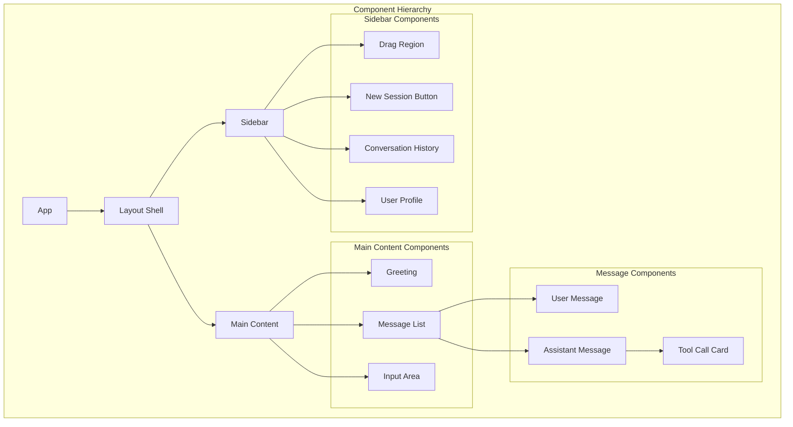
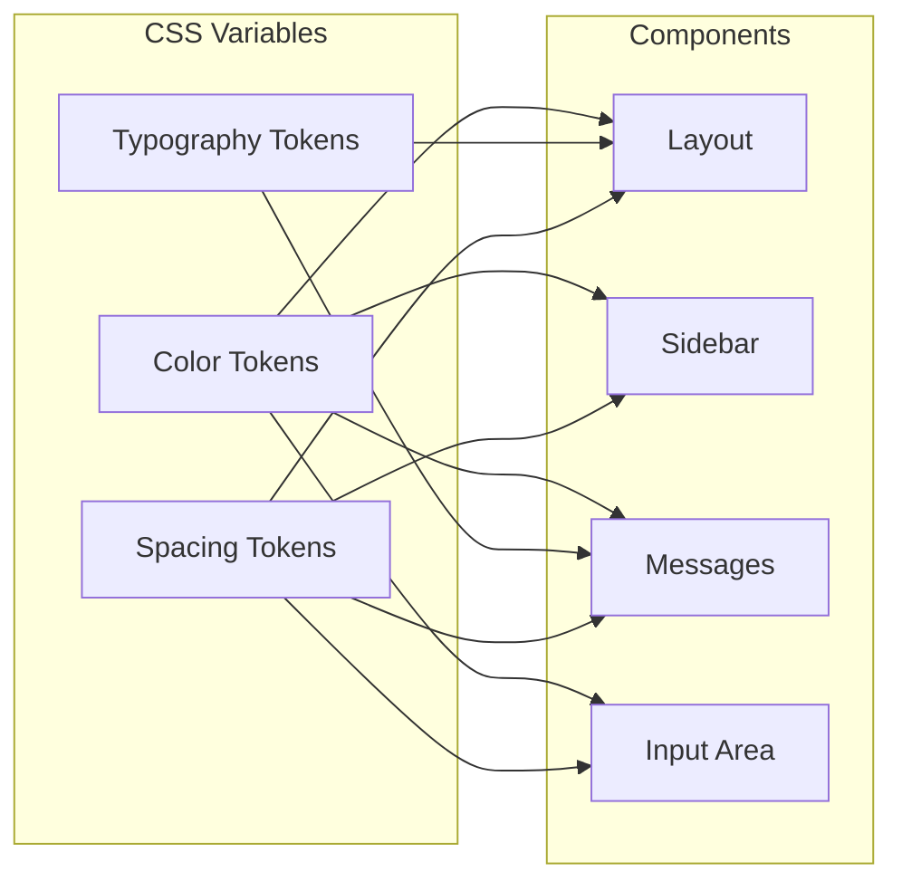

# Design Document: Clinical Zen UI

## Overview

The Clinical Zen UI transforms GoatedApp's visual identity from a standard software interface to a "Stationery" aesthetic—calm, intelligent, paper-like, and trustworthy. This design system replicates Claude's interface patterns while replacing the terracotta/brown palette with Surgical Sage (green) and Slate Blue accents.

The design prioritizes:
- **Calm Aesthetic**: Warm off-white backgrounds, generous whitespace, serif headings
- **Medical-Grade Clarity**: Inter font for body text, clear visual hierarchy
- **Desktop Optimization**: 260px sidebar, centered content area, floating input bar
- **Subtle Interactions**: 200ms transitions, sage green accents for active states

## Architecture



### Design Token Flow



## Components and Interfaces

### 1. Design Token System

The design tokens are implemented as CSS custom properties in `global.css`.

```css
:root {
  /* Base Colors (Warm Paper) */
  --color-background: #FBFBF9;
  --color-surface: #FFFFFF;
  
  /* Text Colors */
  --color-text-primary: #1A1A1A;
  --color-text-secondary: #6B6B6B;
  
  /* Sage Green Scale (Primary Brand) */
  --color-sage-50: #F2F7F4;
  --color-sage-100: #E3EDE7;
  --color-sage-500: #5D8570;
  --color-sage-700: #3D5C4C;
  
  /* Slate Blue Scale (Tech/AI Accent) */
  --color-slate-blue-50: #F0F4F8;
  --color-slate-blue-500: #647D94;
  --color-slate-blue-900: #2A3B4C;
  
  /* Sidebar */
  --color-sidebar-bg: #F7F7F5;
  --color-sidebar-border: #E5E5E3;
  
  /* Typography */
  --font-serif: 'Newsreader', 'Merriweather', Georgia, serif;
  --font-sans: 'Inter', -apple-system, BlinkMacSystemFont, sans-serif;
  
  /* Font Sizes */
  --font-size-caption: 12px;
  --font-size-small: 14px;
  --font-size-body: 16px;
  --font-size-h3: 32px;
  --font-size-h2: 40px;
  --font-size-h1: 48px;
  
  /* Line Heights */
  --line-height-body: 1.5;
  --line-height-heading: 1.25;
  
  /* Spacing */
  --spacing-1: 4px;
  --spacing-2: 8px;
  --spacing-3: 12px;
  --spacing-4: 16px;
  --spacing-6: 24px;
  --spacing-8: 32px;
  --spacing-12: 48px;
  --spacing-16: 64px;
  --spacing-32: 128px;
  
  /* Border Radius */
  --radius-sm: 4px;
  --radius-md: 8px;
  --radius-lg: 16px;
  
  /* Shadows */
  --shadow-sm: 0 1px 2px rgba(0, 0, 0, 0.05);
  --shadow-md: 0 4px 6px rgba(0, 0, 0, 0.07);
  --shadow-lg: 0 10px 15px rgba(0, 0, 0, 0.1);
  
  /* Transitions */
  --transition-fast: 150ms ease;
  --transition-normal: 200ms ease;
}
```

### 2. Layout Shell Component

```typescript
interface LayoutProps {
  children: React.ReactNode;
  sidebarOpen?: boolean;
  onSidebarToggle?: () => void;
}

// Layout structure
// <div class="layout">
//   <aside class="sidebar">...</aside>
//   <main class="main-content">...</main>
// </div>
```

**CSS Structure:**
```css
.layout {
  display: flex;
  height: 100vh;
  width: 100vw;
  background-color: var(--color-background);
  color: var(--color-text-primary);
  font-family: var(--font-sans);
}

.layout::selection {
  background-color: var(--color-sage-100);
  color: var(--color-sage-900);
}
```

### 3. Sidebar Component

```typescript
interface SidebarProps {
  conversations: Conversation[];
  activeConversationId?: string;
  user: User;
  onNewSession: () => void;
  onSelectConversation: (id: string) => void;
  onOpenSettings: () => void;
}

interface Conversation {
  id: string;
  label: string;
  timestamp: Date;
}

interface User {
  name: string;
  initials: string;
}
```

**CSS Structure:**
```css
.sidebar {
  width: 260px;
  flex-shrink: 0;
  background-color: var(--color-sidebar-bg);
  border-right: 1px solid var(--color-sidebar-border);
  display: flex;
  flex-direction: column;
  padding-top: 40px; /* Mac traffic lights spacer */
}

.sidebar__drag-region {
  height: 24px;
  width: 100%;
  -webkit-app-region: drag;
}

.sidebar__new-session {
  margin: 0 var(--spacing-4) var(--spacing-6);
}

.sidebar__history {
  flex: 1;
  overflow-y: auto;
  padding: 0 var(--spacing-2);
}

.sidebar__profile {
  padding: var(--spacing-4);
  border-top: 1px solid var(--color-sidebar-border);
}
```

### 4. New Session Button

```css
.new-session-btn {
  width: 100%;
  display: flex;
  align-items: center;
  justify-content: space-between;
  padding: var(--spacing-2) var(--spacing-3);
  background-color: var(--color-sage-50);
  color: var(--color-sage-700);
  border: 1px solid var(--color-sage-100);
  border-radius: var(--radius-md);
  box-shadow: var(--shadow-sm);
  font-size: var(--font-size-small);
  font-weight: 500;
  transition: background-color var(--transition-normal);
}

.new-session-btn:hover {
  background-color: var(--color-sage-100);
}

.new-session-btn__icon {
  background: white;
  padding: var(--spacing-1);
  border-radius: var(--radius-sm);
  box-shadow: var(--shadow-sm);
  transition: transform var(--transition-normal);
}

.new-session-btn:hover .new-session-btn__icon {
  transform: scale(1.1);
}
```

### 5. Conversation History Item

```css
.history-section__title {
  padding: var(--spacing-2);
  font-size: var(--font-size-caption);
  font-weight: 600;
  color: #9CA3AF; /* gray-400 */
  text-transform: uppercase;
  letter-spacing: 0.05em;
}

.history-item {
  padding: var(--spacing-2);
  border-radius: var(--radius-md);
  cursor: pointer;
  transition: background-color var(--transition-normal);
}

.history-item:hover {
  background-color: rgba(0, 0, 0, 0.05);
}

.history-item--active {
  background-color: rgba(0, 0, 0, 0.08);
}
```

### 6. User Profile Section

```css
.user-profile {
  display: flex;
  align-items: center;
  gap: var(--spacing-3);
  padding: var(--spacing-2);
  border-radius: var(--radius-md);
  cursor: pointer;
  transition: background-color var(--transition-normal);
}

.user-profile:hover {
  background-color: rgba(0, 0, 0, 0.05);
}

.user-profile__avatar {
  width: 32px;
  height: 32px;
  border-radius: 50%;
  background-color: var(--color-slate-blue-500);
  color: white;
  display: flex;
  align-items: center;
  justify-content: center;
  font-family: var(--font-serif);
  font-size: var(--font-size-small);
}

.user-profile__name {
  font-size: var(--font-size-small);
  font-weight: 500;
}
```

### 7. Greeting Component (Empty State)

```typescript
interface GreetingProps {
  userName: string;
  statusMessage?: string;
}
```

```css
.greeting {
  flex: 1;
  display: flex;
  flex-direction: column;
  align-items: center;
  justify-content: center;
  padding-bottom: var(--spacing-32);
}

.greeting__icon {
  width: 64px;
  height: 64px;
  background-color: var(--color-sage-50);
  border-radius: var(--radius-lg);
  display: flex;
  align-items: center;
  justify-content: center;
  margin-bottom: var(--spacing-8);
  box-shadow: var(--shadow-sm);
}

.greeting__icon svg {
  width: 32px;
  height: 32px;
  color: var(--color-sage-500);
}

.greeting__title {
  font-family: var(--font-serif);
  font-size: clamp(40px, 5vw, 50px);
  color: var(--color-text-primary);
  margin-bottom: var(--spacing-4);
  letter-spacing: -0.02em;
}

.greeting__subtitle {
  color: var(--color-text-secondary);
  font-size: 18px;
  font-weight: 300;
  max-width: 448px;
  text-align: center;
}

.greeting__status {
  margin-top: var(--spacing-2);
  font-size: var(--font-size-small);
  font-weight: 500;
  color: var(--color-sage-500);
}

.greeting__status::before {
  content: '●';
  margin-right: var(--spacing-1);
}
```

### 8. Input Area Component

```typescript
interface InputAreaProps {
  isListening: boolean;
  value: string;
  onChange: (value: string) => void;
  onSubmit: () => void;
  onMicClick: () => void;
  onAttachClick?: () => void;
}
```

```css
.input-area {
  position: absolute;
  bottom: 0;
  left: 0;
  right: 0;
  padding: var(--spacing-6);
  background: linear-gradient(
    to top,
    var(--color-background) 60%,
    transparent
  );
  padding-top: 80px;
}

.input-area__container {
  max-width: 768px;
  margin: 0 auto;
}

.input-area__box {
  position: relative;
  background-color: var(--color-surface);
  border-radius: var(--radius-lg);
  box-shadow: var(--shadow-lg);
  border: 1px solid #E5E7EB; /* gray-200 */
  transition: border-color var(--transition-normal), 
              box-shadow var(--transition-normal);
}

.input-area__box--listening {
  border-color: var(--color-sage-500);
  box-shadow: var(--shadow-lg), 0 0 0 4px rgba(93, 133, 112, 0.1);
}

.input-area__textarea {
  width: 100%;
  background: transparent;
  border: none;
  padding: var(--spacing-4);
  min-height: 60px;
  resize: none;
  font-family: var(--font-sans);
  font-size: var(--font-size-body);
  color: var(--color-text-primary);
}

.input-area__textarea::placeholder {
  color: #9CA3AF; /* gray-400 */
}

.input-area__textarea:focus {
  outline: none;
}

.input-area__actions {
  display: flex;
  justify-content: space-between;
  align-items: center;
  padding: 0 var(--spacing-4) var(--spacing-3);
}

.input-area__attach-btn {
  color: #9CA3AF;
  transition: color var(--transition-normal);
}

.input-area__attach-btn:hover {
  color: #6B7280;
}

.input-area__mic-btn {
  padding: var(--spacing-2);
  border-radius: var(--radius-md);
  display: flex;
  align-items: center;
  gap: var(--spacing-2);
  transition: all var(--transition-normal);
}

.input-area__mic-btn--idle {
  background-color: var(--color-sage-50);
  color: var(--color-sage-700);
}

.input-area__mic-btn--idle:hover {
  background-color: var(--color-sage-100);
}

.input-area__mic-btn--listening {
  background-color: var(--color-sage-500);
  color: white;
  box-shadow: var(--shadow-md);
  transform: scale(1.05);
}

.input-area__mic-btn--listening svg {
  animation: pulse 1.5s ease-in-out infinite;
}

@keyframes pulse {
  0%, 100% { opacity: 1; }
  50% { opacity: 0.5; }
}

.input-area__disclaimer {
  text-align: center;
  margin-top: var(--spacing-3);
  font-size: var(--font-size-caption);
  color: #9CA3AF;
}
```

### 9. Message Components

```typescript
interface MessageProps {
  role: 'user' | 'assistant' | 'tool';
  content: string;
  timestamp?: Date;
  toolCalls?: ToolCall[];
}

interface ToolCall {
  id: string;
  name: string;
  arguments: string;
  result?: string;
  status: 'pending' | 'success' | 'error';
}
```

```css
.message {
  display: flex;
  width: 100%;
  max-width: 768px;
  margin: 0 auto var(--spacing-8);
}

.message--user {
  justify-content: flex-end;
}

.message--assistant {
  justify-content: flex-start;
}

.message__avatar {
  width: 32px;
  height: 32px;
  border-radius: var(--radius-md);
  background-color: var(--color-sage-100);
  color: var(--color-sage-700);
  display: flex;
  align-items: center;
  justify-content: center;
  margin-right: var(--spacing-4);
  flex-shrink: 0;
  margin-top: var(--spacing-1);
}

.message__content {
  max-width: 80%;
  font-size: var(--font-size-body);
  line-height: 1.625;
}

.message__content--user {
  background-color: #F0F0EE;
  padding: var(--spacing-3) var(--spacing-4);
  border-radius: var(--radius-lg);
  font-family: var(--font-serif);
  color: var(--color-text-primary);
}

.message__content--assistant {
  font-family: var(--font-sans);
  color: var(--color-text-primary);
}
```

### 10. Tool Call Card

```css
.tool-card {
  margin-top: var(--spacing-4);
  background-color: #E6F4F1;
  border-left: 3px solid var(--color-sage-500);
  border-radius: var(--radius-md);
  overflow: hidden;
}

.tool-card__header {
  display: flex;
  align-items: center;
  justify-content: space-between;
  padding: var(--spacing-3) var(--spacing-4);
  cursor: pointer;
}

.tool-card__name {
  font-weight: 500;
  font-size: var(--font-size-small);
  color: var(--color-sage-700);
}

.tool-card__status {
  display: flex;
  align-items: center;
  gap: var(--spacing-2);
  font-size: var(--font-size-caption);
  color: var(--color-text-secondary);
}

.tool-card__body {
  padding: 0 var(--spacing-4) var(--spacing-3);
  font-size: var(--font-size-small);
  color: var(--color-text-secondary);
}

.tool-card__body--collapsed {
  display: none;
}
```

## Data Models

### Theme Configuration

```typescript
interface ThemeConfig {
  colors: {
    background: string;
    surface: string;
    textPrimary: string;
    textSecondary: string;
    sage: {
      50: string;
      100: string;
      500: string;
      700: string;
    };
    slateBlue: {
      50: string;
      500: string;
      900: string;
    };
    sidebarBg: string;
    sidebarBorder: string;
  };
  typography: {
    fontSerif: string;
    fontSans: string;
    sizes: {
      caption: string;
      small: string;
      body: string;
      h3: string;
      h2: string;
      h1: string;
    };
  };
  spacing: Record<number, string>;
  borderRadius: {
    sm: string;
    md: string;
    lg: string;
  };
}
```

### Component State

```typescript
interface LayoutState {
  sidebarOpen: boolean;
  sidebarCollapsed: boolean;
}

interface InputAreaState {
  value: string;
  isListening: boolean;
  isFocused: boolean;
}

interface MessageListState {
  messages: Message[];
  isLoading: boolean;
  expandedToolCards: Set<string>;
}
```

## Correctness Properties

*A property is a characteristic or behavior that should hold true across all valid executions of a system—essentially, a formal statement about what the system should do. Properties serve as the bridge between human-readable specifications and machine-verifiable correctness guarantees.*

### Property 1: Conversation Item Text Truncation

*For any* conversation item with a label longer than the container width, the text SHALL be truncated with ellipsis and not overflow the container bounds.

**Validates: Requirements 4.3**

### Property 2: Message Role-Based Styling

*For any* message with role 'user' or 'assistant', the Message_Bubble SHALL apply the correct alignment (justify-end for user, justify-start for assistant), avatar presence (only for assistant), and content styling (background and font family based on role).

**Validates: Requirements 9.1, 9.2, 9.3, 9.5, 9.6**

### Property 3: Tool Call Card Conditional Rendering

*For any* assistant message, if the message contains a non-empty tool_calls array, the Message_Bubble SHALL render a Tool_Call_Card component for each tool call.

**Validates: Requirements 10.1**

### Property 4: Interactive Element Transition Consistency

*For any* interactive element (button, input, clickable item), the element SHALL have a CSS transition property with duration between 150ms and 300ms.

**Validates: Requirements 12.1**

### Property 5: Button Hover State Change

*For any* button element, when hovered, the computed background-color or color SHALL differ from the non-hovered state.

**Validates: Requirements 12.2**

### Property 6: Input Focus Ring

*For any* input or textarea element, when focused, the element SHALL display a visible focus indicator (outline or box-shadow) using the sage-500 color.

**Validates: Requirements 12.3**

## Error Handling

### Component Rendering Errors

| Error Type | Handling Strategy |
|------------|-------------------|
| Missing font files | Fall back to system fonts (Inter → system sans, Newsreader → Georgia) |
| Invalid color token | Use CSS fallback values defined in custom properties |
| Missing user data | Display placeholder initials "?" for avatar |
| Empty conversation list | Display "No conversations yet" empty state |
| Long text overflow | Apply text-overflow: ellipsis with overflow: hidden |

### Responsive Behavior Errors

| Error Type | Handling Strategy |
|------------|-------------------|
| Viewport resize during animation | Cancel ongoing transitions, apply final state |
| Touch events on desktop | Ignore touch-specific handlers, use mouse events |
| Sidebar state mismatch | Reset to default state (open on desktop, closed on mobile) |

### State Management Errors

| Error Type | Handling Strategy |
|------------|-------------------|
| Invalid listening state | Reset to false, log warning |
| Missing message role | Default to 'assistant' role styling |
| Tool card expand/collapse failure | Reset to collapsed state |

## Testing Strategy

### Dual Testing Approach

This feature uses both unit tests and property-based tests:

- **Unit tests**: Verify specific CSS values, component rendering, and state transitions
- **Property tests**: Verify universal styling rules across all instances

### Testing Framework

- **Unit Testing**: Vitest with React Testing Library
- **Property-Based Testing**: fast-check for TypeScript
- **Visual Regression**: Playwright for screenshot comparisons
- **Accessibility Testing**: axe-core for a11y compliance

### Property-Based Test Configuration

Each property test MUST:
- Run minimum 100 iterations
- Reference the design document property number
- Use tag format: **Feature: clinical-zen-ui, Property {number}: {property_text}**

### Test Organization

```
tests/
├── unit/
│   ├── components/
│   │   ├── Layout.test.tsx
│   │   ├── Sidebar.test.tsx
│   │   ├── Greeting.test.tsx
│   │   ├── InputArea.test.tsx
│   │   ├── Message.test.tsx
│   │   └── ToolCallCard.test.tsx
│   └── styles/
│       ├── design-tokens.test.ts
│       └── typography.test.ts
├── property/
│   ├── message-styling.property.ts
│   ├── text-truncation.property.ts
│   └── interactive-states.property.ts
└── visual/
    ├── layout.spec.ts
    ├── sidebar.spec.ts
    └── messages.spec.ts
```

### Key Test Scenarios

#### Design Token Tests
- Verify all color tokens have correct hex values
- Verify font family fallback chains
- Verify spacing scale values

#### Component Styling Tests
- Layout shell flex properties
- Sidebar width and background
- Message alignment based on role
- Input area positioning and gradient

#### Interactive State Tests
- Button hover state changes (Property 5)
- Input focus ring visibility (Property 6)
- Microphone button listening state
- Sidebar collapse/expand transitions

#### Responsive Tests
- Sidebar collapse at 1024px breakpoint
- Hamburger menu visibility
- Touch-friendly tap targets

