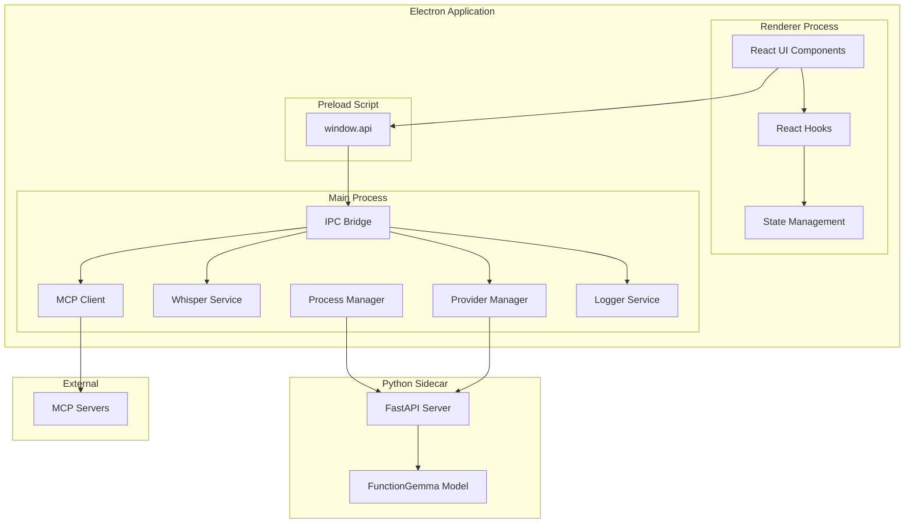
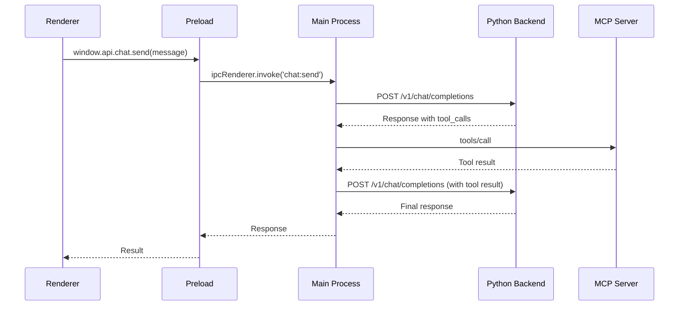

# Design Document: GoatedApp

## Overview

GoatedApp is a cross-platform Electron application implementing a privacy-first clinical orchestration platform. The architecture follows a multi-process design with clear separation between the Electron main process, renderer process, and a Python sidecar for local AI inference. The application implements the Model Context Protocol (MCP) client specification to enable extensible tool execution across healthcare systems.

The design prioritizes:
- **Privacy**: All AI inference runs locally via FunctionGemma and Whisper
- **Offline Capability**: Core functionality works without internet connectivity
- **Extensibility**: MCP architecture allows adding new tools without code changes
- **User Experience**: Claude-inspired interface with green color palette for a calm, professional feel

## Architecture



### Process Communication Flow



## Components and Interfaces

### 1. Electron Main Process Components

#### 1.1 IPC Bridge

The IPC Bridge provides secure communication between renderer and main processes.

```typescript
interface IPCBridge {
  // Chat operations
  'chat:send': (message: ChatMessage) => Promise<ChatResponse>;
  'chat:getHistory': (conversationId: string) => Promise<ChatMessage[]>;
  
  // Transcription operations
  'transcription:transcribe': (audioBuffer: ArrayBuffer) => Promise<string>;
  
  // Backend operations
  'backend:status': () => Promise<BackendStatus>;
  'backend:restart': () => Promise<void>;
  
  // Provider operations
  'provider:list': () => Promise<Provider[]>;
  'provider:setActive': (providerId: string) => Promise<void>;
  'provider:getActive': () => Promise<Provider>;
  
  // MCP operations
  'mcp:connect': (serverConfig: MCPServerConfig) => Promise<void>;
  'mcp:disconnect': (serverId: string) => Promise<void>;
  'mcp:listTools': () => Promise<MCPTool[]>;
  
  // Model operations
  'model:list': () => Promise<ModelInfo[]>;
  'model:download': (modelId: string) => Promise<void>;
  'model:getDownloadProgress': (modelId: string) => Promise<DownloadProgress>;
}
```

#### 1.2 MCP Client

Implements the Model Context Protocol client specification.

```typescript
interface MCPClient {
  connect(config: MCPServerConfig): Promise<void>;
  disconnect(serverId: string): Promise<void>;
  listTools(): Promise<MCPTool[]>;
  callTool(name: string, args: Record<string, unknown>): Promise<MCPToolResult>;
  onDisconnected(callback: (serverId: string) => void): void;
  onToolsChanged(callback: (tools: MCPTool[]) => void): void;
}

interface MCPServerConfig {
  id: string;
  name: string;
  transport: 'stdio' | 'sse';
  command?: string;        // For stdio transport
  args?: string[];         // For stdio transport
  url?: string;            // For SSE transport
}

interface MCPTool {
  name: string;
  description: string;
  inputSchema: JSONSchema;
  serverId: string;
}

interface MCPToolResult {
  content: Array<{
    type: 'text' | 'image' | 'resource';
    text?: string;
    data?: string;
    mimeType?: string;
  }>;
  isError?: boolean;
}
```

#### 1.3 Whisper Service

Handles local speech-to-text transcription.

```typescript
interface WhisperService {
  initialize(): Promise<void>;
  transcribe(audioFilePath: string): Promise<string>;
  setModel(modelName: WhisperModel): Promise<void>;
  getAvailableModels(): WhisperModel[];
}

type WhisperModel = 'base.en' | 'small.en' | 'medium.en' | 'distil-large-v3';

interface WhisperConfig {
  modelName: WhisperModel;
  modelPath: string;
  language: 'auto' | string;
}
```

#### 1.4 Process Manager

Manages the Python sidecar lifecycle.

```typescript
interface ProcessManager {
  start(): Promise<void>;
  stop(): Promise<void>;
  restart(): Promise<void>;
  getStatus(): BackendStatus;
  onStatusChange(callback: (status: BackendStatus) => void): void;
}

interface BackendStatus {
  running: boolean;
  pid: number | null;
  restartCount: number;
  lastHealthCheck: Date | null;
  healthy: boolean;
}
```

#### 1.5 Provider Manager

Manages AI provider configurations.

```typescript
interface ProviderManager {
  listProviders(): Provider[];
  getActiveProvider(): Provider;
  setActiveProvider(providerId: string): void;
  addProvider(provider: Provider): void;
  removeProvider(providerId: string): void;
  createClient(provider: Provider): AIClient;
  onProviderChanged(callback: (provider: Provider) => void): void;
}

interface Provider {
  id: string;
  name: string;
  type: 'local' | 'openai' | 'anthropic' | 'azure-openai';
  baseURL: string;
  apiKey?: string;
  isDefault?: boolean;
}
```

### 2. Python Backend Components

#### 2.1 FastAPI Server

```python
class ChatRequest(BaseModel):
    messages: list[ChatMessage]
    tools: list[ToolDefinition] | None = None
    tool_choice: str | None = None

class ChatMessage(BaseModel):
    role: str  # 'user' | 'assistant' | 'system' | 'tool'
    content: str
    tool_call_id: str | None = None
    tool_calls: list[ToolCall] | None = None

class ToolDefinition(BaseModel):
    type: str  # 'function'
    function: FunctionDefinition

class FunctionDefinition(BaseModel):
    name: str
    description: str
    parameters: dict  # JSON Schema

class ToolCall(BaseModel):
    id: str
    type: str  # 'function'
    function: FunctionCall

class FunctionCall(BaseModel):
    name: str
    arguments: str  # JSON string

class ChatResponse(BaseModel):
    id: str
    object: str  # 'chat.completion'
    created: int
    model: str
    choices: list[Choice]

class Choice(BaseModel):
    index: int
    message: ChatMessage
    finish_reason: str  # 'stop' | 'tool_calls'
```

### 3. Renderer Process Components

#### 3.1 React Component Hierarchy

```
App
├── Sidebar
│   ├── NewChatButton
│   ├── ConversationList
│   │   └── ConversationItem
│   └── SettingsButton
├── MainContent
│   ├── Header
│   │   ├── Logo
│   │   └── ConversationTitle
│   ├── MessageList
│   │   ├── UserMessage
│   │   ├── AssistantMessage
│   │   └── ToolCallCard
│   └── InputArea
│       ├── TextInput
│       ├── MicrophoneButton
│       └── SendButton
└── SettingsModal
    ├── GeneralTab
    ├── ModelsTab
    ├── ProvidersTab
    └── AboutTab
```

#### 3.2 React Hooks

```typescript
// Audio recording hook
interface UseRecorder {
  isRecording: boolean;
  startRecording: () => Promise<void>;
  stopRecording: () => Promise<string>;
  error: Error | null;
}

// Chat hook
interface UseChat {
  messages: ChatMessage[];
  isLoading: boolean;
  sendMessage: (content: string) => Promise<void>;
  clearMessages: () => void;
  error: Error | null;
}

// Backend status hook
interface UseBackendStatus {
  status: BackendStatus;
  restart: () => Promise<void>;
}

// MCP tools hook
interface UseMCPTools {
  tools: MCPTool[];
  isConnected: boolean;
  connect: (config: MCPServerConfig) => Promise<void>;
  disconnect: (serverId: string) => Promise<void>;
}
```

## Data Models

### Conversation Storage (IndexedDB)

```typescript
interface Conversation {
  id: string;
  title: string;
  createdAt: Date;
  updatedAt: Date;
  messages: StoredMessage[];
}

interface StoredMessage {
  id: string;
  conversationId: string;
  role: 'user' | 'assistant' | 'tool';
  content: string;
  timestamp: Date;
  toolCallId?: string;
  toolCalls?: ToolCallData[];
}

interface ToolCallData {
  id: string;
  name: string;
  arguments: string;
  result?: string;
  status: 'pending' | 'success' | 'error';
}
```

### Provider Configuration (JSON File)

```typescript
interface ProvidersConfig {
  activeProviderId: string;
  providers: Provider[];
}

// Stored at: {userData}/providers.json
```

### Model Registry

```typescript
interface ModelInfo {
  id: string;
  name: string;
  type: 'llm' | 'whisper';
  size: number;  // bytes
  downloadUrl: string;
  sha256: string;
  status: 'not_downloaded' | 'downloading' | 'downloaded';
  localPath?: string;
}

interface DownloadProgress {
  modelId: string;
  bytesDownloaded: number;
  totalBytes: number;
  percentage: number;
}
```

### Design System Tokens

```typescript
interface DesignTokens {
  colors: {
    primary: '#10A37F';
    primaryHover: '#1A7F64';
    background: '#FFFFFF';
    backgroundSecondary: '#F7F7F8';
    border: '#ECECF1';
    textPrimary: '#353740';
    textSecondary: '#6E6E80';
    textOnPrimary: '#FFFFFF';
    sidebarBg: '#202123';
    sidebarSelected: '#343541';
    toolCallBg: '#E6F4F1';
    error: '#EF4444';
    success: '#10A37F';
  };
  typography: {
    fontFamily: "'Söhne', 'Inter', system-ui, sans-serif";
    fontSize: {
      small: '13px';
      body: '15px';
      h3: '18px';
      h2: '24px';
      h1: '32px';
    };
    lineHeight: {
      body: 1.5;
      heading: 1.25;
    };
  };
  spacing: {
    base: 8;  // px
    scale: [8, 16, 24, 32, 48];
  };
  borderRadius: {
    small: '4px';
    button: '6px';
    card: '8px';
    modal: '16px';
  };
}
```


## Correctness Properties

*A property is a characteristic or behavior that should hold true across all valid executions of a system—essentially, a formal statement about what the system should do. Properties serve as the bridge between human-readable specifications and machine-verifiable correctness guarantees.*

### Property 1: IPC Bridge Request Forwarding

*For any* valid `window.api` method call from the Renderer_Process, the IPC_Bridge SHALL forward the request to the corresponding handler in the Main_Process and return the result.

**Validates: Requirements 1.6**

### Property 2: MCP Connection Handshake Sequence

*For any* MCP server connection attempt, the MCP_Client SHALL send an 'initialize' request followed by 'notifications/initialized' before any other protocol messages.

**Validates: Requirements 2.4, 2.5**

### Property 3: MCP Tool Discovery Completeness

*For any* connected MCP server, calling `listTools()` SHALL return all tools with their name, description, and inputSchema stored in the Tool_Registry.

**Validates: Requirements 2.6, 2.7**

### Property 4: MCP Tool Invocation Format

*For any* tool invocation with name and arguments, the MCP_Client SHALL send a 'tools/call' request where the arguments object matches the tool's inputSchema.

**Validates: Requirements 2.8**

### Property 5: MCP Tool Response Parsing

*For any* tool response containing a content array, the MCP_Client SHALL correctly extract and return all text, image, or resource content items.

**Validates: Requirements 2.9**

### Property 6: MCP Error Propagation

*For any* MCP server error response, the MCP_Client SHALL propagate the error message to the caller without modification.

**Validates: Requirements 2.10**

### Property 7: MCP Reconnection Backoff

*For any* lost MCP server connection, the reconnection attempts SHALL follow exponential backoff timing: 1s, 2s, 4s, 8s, 16s, capped at 30s.

**Validates: Requirements 2.11**

### Property 8: MCP JSON Serialization Round-Trip

*For any* valid tool arguments object, serializing to JSON and deserializing back SHALL produce an equivalent object.

**Validates: Requirements 2.12**

### Property 9: Backend Request Schema Validation

*For any* request to `/v1/chat/completions` with valid messages array, optional tools array, and optional tool_choice, the FunctionGemma_Backend SHALL accept and process the request.

**Validates: Requirements 3.4**

### Property 10: Backend Tool Choice Auto-Setting

*For any* chat request that includes a non-empty tools array, the FunctionGemma_Backend SHALL set tool_choice="auto" for the model inference.

**Validates: Requirements 3.8**

### Property 11: Backend Tool Call Response Format

*For any* model response that generates tool calls, the FunctionGemma_Backend SHALL return a response with choices[0].message.tool_calls as a valid array of ToolCall objects.

**Validates: Requirements 3.9**

### Property 12: Backend Inference Error Handling

*For any* model inference failure, the FunctionGemma_Backend SHALL return HTTP 500 with the exception message in the response body.

**Validates: Requirements 3.11**

### Property 13: Whisper Transcription Invocation

*For any* valid audio file path, calling `transcribe()` SHALL invoke whisper.cpp and return a string result.

**Validates: Requirements 4.4**

### Property 14: Whisper Segment Concatenation

*For any* transcription result with multiple segments, the Whisper_Service SHALL concatenate all segment.speech values with spaces and return the trimmed result.

**Validates: Requirements 4.7**

### Property 15: Whisper Error Propagation

*For any* whisper.cpp failure, the Whisper_Service SHALL log the error and re-throw with additional context.

**Validates: Requirements 4.9**

### Property 16: Audio Recording State Consistency

*For any* recording session, isRecording SHALL be true while recording is active and false otherwise, and SHALL transition to false when transcription completes.

**Validates: Requirements 5.5, 5.9**

### Property 17: Audio Recording Data Flow

*For any* completed recording, the Audio_Recorder SHALL: request microphone access, create MediaRecorder, accumulate chunks, combine into WAV blob, convert to ArrayBuffer, and send via IPC.

**Validates: Requirements 5.2, 5.3, 5.4, 5.6, 5.7, 5.8**

### Property 18: Provider Change Event Emission

*For any* active provider change via `setActiveProvider()`, the Provider_Manager SHALL emit a 'provider-changed' event with the new provider id.

**Validates: Requirements 6.5**

### Property 19: Provider Configuration Persistence Round-Trip

*For any* provider configuration change, persisting to JSON and loading back SHALL produce an equivalent configuration.

**Validates: Requirements 6.6**

### Property 20: Process Output Capture

*For any* stdout or stderr output from the Python process, the GoatedApp SHALL capture and log it with the "[FunctionGemma]" prefix.

**Validates: Requirements 7.4**

### Property 21: Process Restart Policy

*For any* sequence of process failures, the GoatedApp SHALL: restart after health check fails 3 times, restart after unexpected exit with 2s delay, and limit to 5 restarts within 60 seconds.

**Validates: Requirements 7.7, 7.8, 7.9**

### Property 22: Message Role Assignment

*For any* message added to the conversation, it SHALL have the correct role ('user', 'assistant', or 'tool') and display role, content, and timestamp.

**Validates: Requirements 8.3, 8.6, 8.9, 8.11**

### Property 23: Conversation Flow to AI

*For any* user message or tool result, the GoatedApp SHALL send the updated conversation to the AI provider and process the response.

**Validates: Requirements 8.7, 8.10, 8.12**

### Property 24: Conversation Loading State

*For any* pending AI response, the GoatedApp SHALL display a loading indicator until the response is received.

**Validates: Requirements 8.8**

### Property 25: Conversation Persistence Round-Trip

*For any* conversation with messages, persisting to IndexedDB and loading back SHALL produce an equivalent conversation.

**Validates: Requirements 8.13**

### Property 26: Model Info Display Completeness

*For any* model in the registry, the settings panel SHALL display name, size, download status, and file path, with a Download button if not downloaded.

**Validates: Requirements 9.2, 9.3, 9.4**

### Property 27: Model Download Initiation

*For any* Download button click, the GoatedApp SHALL start downloading the model file to the models directory.

**Validates: Requirements 9.5**

### Property 28: Model Download Progress

*For any* active download, the GoatedApp SHALL display a progress bar showing the percentage complete.

**Validates: Requirements 9.6**

### Property 29: Model Checksum Verification

*For any* completed model download, the GoatedApp SHALL verify the file's SHA256 checksum matches the expected value.

**Validates: Requirements 9.7**

### Property 30: Error Logging Format

*For any* error in the Main_Process, the error handler SHALL log it with timestamp, error type, message, and stack trace.

**Validates: Requirements 10.2**

### Property 31: Renderer Error Forwarding

*For any* error in the Renderer_Process, the error handler SHALL send it to the Main_Process via IPC for centralized logging.

**Validates: Requirements 10.3**

### Property 32: Log File Rotation

*For any* log file exceeding 10MB, the GoatedApp SHALL rotate it and keep the last 5 log files.

**Validates: Requirements 10.5**

### Property 33: User-Facing Error Toast

*For any* user-facing error, the GoatedApp SHALL display a toast notification with a human-readable message.

**Validates: Requirements 10.6**

### Property 34: PHI Redaction in Logs

*For any* log entry, message contents that may contain PHI SHALL be redacted before writing to the log file.

**Validates: Requirements 10.8**

## Error Handling

### Main Process Errors

| Error Type | Handling Strategy |
|------------|-------------------|
| Python backend spawn failure | Log error, display toast, retry up to 5 times |
| Python backend crash | Auto-restart with 2s delay, limit 5 restarts/60s |
| Health check failure | After 3 consecutive failures, restart backend |
| MCP connection failure | Emit 'disconnected' event, exponential backoff reconnect |
| MCP tool execution error | Propagate error to conversation, display in UI |
| Whisper transcription failure | Log error, throw to caller, display toast |
| Model download failure | Delete partial file, display error toast |
| Checksum verification failure | Delete corrupted file, display error toast |
| File system errors | Log error, display toast with details |

### Renderer Process Errors

| Error Type | Handling Strategy |
|------------|-------------------|
| Microphone access denied | Display "Microphone access denied" error |
| No microphone found | Display "No microphone found" error |
| IPC communication failure | Display toast, log to main process |
| IndexedDB errors | Log error, attempt recovery, display toast |
| Network errors (for cloud providers) | Display toast with retry option |

### Python Backend Errors

| Error Type | HTTP Status | Response |
|------------|-------------|----------|
| Model not loaded | 500 | `{"detail": "Model not loaded"}` |
| Invalid request schema | 422 | Pydantic validation error |
| Inference failure | 500 | `{"detail": "<exception message>"}` |
| Out of memory | 500 | `{"detail": "Out of memory during inference"}` |

## Testing Strategy

### Dual Testing Approach

This project uses both unit tests and property-based tests for comprehensive coverage:

- **Unit tests**: Verify specific examples, edge cases, and error conditions
- **Property tests**: Verify universal properties across all valid inputs

### Testing Framework

- **Unit Testing**: Vitest for TypeScript/JavaScript, pytest for Python
- **Property-Based Testing**: fast-check for TypeScript, Hypothesis for Python
- **E2E Testing**: Playwright for Electron application testing

### Property-Based Test Configuration

Each property test MUST:
- Run minimum 100 iterations
- Reference the design document property number
- Use tag format: **Feature: goated-app, Property {number}: {property_text}**

### Test Organization

```
tests/
├── unit/
│   ├── main/
│   │   ├── mcp-client.test.ts
│   │   ├── whisper-service.test.ts
│   │   ├── process-manager.test.ts
│   │   ├── provider-manager.test.ts
│   │   └── logger.test.ts
│   ├── renderer/
│   │   ├── hooks/
│   │   │   ├── useRecorder.test.ts
│   │   │   └── useChat.test.ts
│   │   └── components/
│   │       └── MessageList.test.tsx
│   └── python/
│       └── test_server.py
├── property/
│   ├── mcp-client.property.ts
│   ├── provider-manager.property.ts
│   ├── conversation.property.ts
│   └── python/
│       └── test_server_properties.py
└── e2e/
    ├── app-launch.spec.ts
    ├── conversation-flow.spec.ts
    └── settings.spec.ts
```

### Key Test Scenarios

#### MCP Client Tests
- Connection handshake sequence (Property 2)
- Tool discovery and storage (Property 3)
- Tool invocation format validation (Property 4)
- Error propagation (Property 6)
- JSON serialization round-trip (Property 8)

#### Audio Recording Tests
- State transitions during recording (Property 16)
- Data flow from microphone to transcription (Property 17)
- Error handling for permission denied

#### Conversation Tests
- Message role assignment (Property 22)
- Conversation persistence round-trip (Property 25)
- Tool call execution flow (Property 23)

#### Process Management Tests
- Restart policy enforcement (Property 21)
- Output capture (Property 20)
- Graceful shutdown sequence

#### Python Backend Tests
- Request schema validation (Property 9)
- Tool call response format (Property 11)
- Error response format (Property 12)
