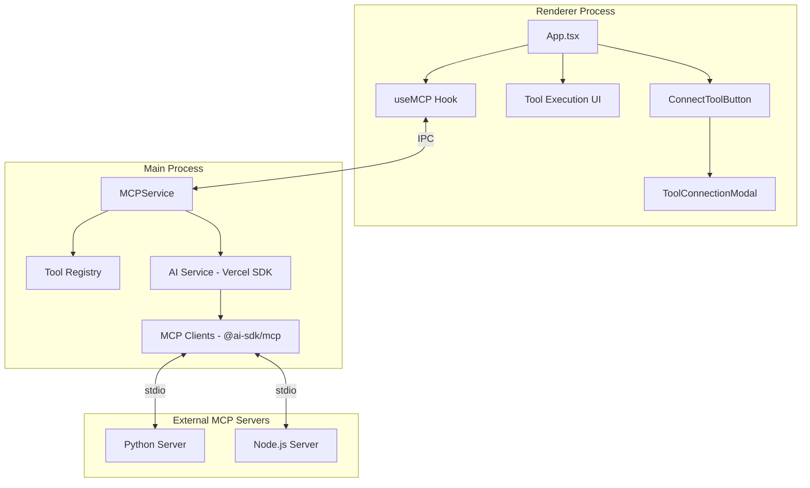

# Design Document: MCP Client

## Overview

This design document describes the implementation of Model Context Protocol (MCP) client capabilities for GoatedApp. The MCP client enables the application to connect to external MCP servers (Python or Node.js scripts) via stdio transport, discover available tools, and execute tool calls when requested by the Gemini AI model.

The implementation uses **Vercel AI SDK v6** with `@ai-sdk/mcp` for MCP client functionality and `@ai-sdk/google` for Gemini integration. This provides a unified, type-safe API for tool calling, structured outputs, and seamless MCP server integration. The SDK handles the complete tool execution loop automatically via the `ToolLoopAgent` abstraction.

## Architecture



## Key Technologies

- **Vercel AI SDK v6**: Unified API for AI providers with built-in tool calling support
- **@ai-sdk/google**: Google Gemini provider for AI SDK
- **@ai-sdk/mcp**: MCP client implementation with stdio transport support
- **Electron IPC**: Secure communication between renderer and main process

## Components and Interfaces

### 1. MCPService (Main Process)

The core service that manages MCP server connections using Vercel AI SDK's `@ai-sdk/mcp`.

```typescript
import { createMCPClient } from '@ai-sdk/mcp';
import { google } from '@ai-sdk/google';
import { generateText, streamText } from 'ai';

interface MCPServerConnection {
  id: string;
  name: string;
  scriptPath: string;
  client: Awaited<ReturnType<typeof createMCPClient>>;
  tools: MCPTool[];
  status: 'connecting' | 'connected' | 'disconnected' | 'error';
}

interface MCPTool {
  name: string;
  description: string;
  inputSchema: Record<string, unknown>;
  serverId: string;
}

interface MCPService {
  // Connect to an MCP server by script path using stdio transport
  connect(scriptPath: string): Promise<MCPServerConnection>;
  
  // Disconnect from a server
  disconnect(serverId: string): Promise<void>;
  
  // Get all connected servers
  getConnectedServers(): MCPServerConnection[];
  
  // Get all available tools from all servers (for Gemini)
  getAllTools(): Record<string, unknown>;
  
  // Process chat with tool execution via AI SDK
  chat(messages: Message[], tools: Record<string, unknown>): Promise<ChatResult>;
}
```

### 2. AI Integration with Vercel SDK

```typescript
import { google } from '@ai-sdk/google';
import { generateText, streamText, tool } from 'ai';

// Using Gemini 2.5 Pro via AI SDK
const model = google('gemini-2.5-pro');

// Chat with automatic tool execution
const result = await generateText({
  model,
  messages,
  tools: mcpService.getAllTools(),
  maxSteps: 10, // Allow up to 10 tool execution steps
});
```

### 2. ConnectToolButton Component

A visually appealing button in the top-right corner of the main content area.

```typescript
interface ConnectToolButtonProps {
  onClick: () => void;
  connectedCount: number;
}
```

### 3. ToolConnectionModal Component

Modal for connecting to MCP servers and managing connections.

```typescript
interface ToolConnectionModalProps {
  isOpen: boolean;
  onClose: () => void;
  connectedServers: MCPServerConnection[];
  onConnect: (path: string) => Promise<void>;
  onDisconnect: (serverId: string) => Promise<void>;
}
```

### 4. useMCP Hook

React hook for MCP operations in the renderer.

```typescript
interface UseMCPReturn {
  connectedServers: MCPServerConnection[];
  tools: MCPTool[];
  isConnecting: boolean;
  error: string | null;
  connect: (path: string) => Promise<void>;
  disconnect: (serverId: string) => Promise<void>;
}
```

### 5. IPC Channels

```typescript
// Preload API extensions
interface MCPApi {
  connect: (scriptPath: string) => Promise<{ success: boolean; server?: MCPServerConnection; error?: string }>;
  disconnect: (serverId: string) => Promise<{ success: boolean; error?: string }>;
  listServers: () => Promise<MCPServerConnection[]>;
  listTools: () => Promise<MCPTool[]>;
  executeTool: (toolName: string, args: Record<string, unknown>) => Promise<{ success: boolean; result?: unknown; error?: string }>;
}
```

## Data Models

### Server Connection State

```typescript
interface ServerState {
  id: string;
  name: string;
  scriptPath: string;
  status: 'connecting' | 'connected' | 'disconnected' | 'error';
  tools: MCPTool[];
  connectedAt?: number;
  error?: string;
}
```

### Tool Execution State

```typescript
interface ToolExecutionState {
  id: string;
  toolName: string;
  arguments: Record<string, unknown>;
  status: 'pending' | 'success' | 'error';
  result?: unknown;
  error?: string;
  startedAt: number;
  completedAt?: number;
}
```

## Correctness Properties

*A property is a characteristic or behavior that should hold true across all valid executions of a system—essentially, a formal statement about what the system should do. Properties serve as the bridge between human-readable specifications and machine-verifiable correctness guarantees.*

### Property 1: Path Extension Validation

*For any* server script path provided to the MCP client, the path SHALL be accepted only if it ends with ".py" or ".js", and rejected with an appropriate error message otherwise.

**Validates: Requirements 2.8, 7.2, 8.3**

### Property 2: Command Selection by Extension

*For any* valid server script path, if the path ends with ".py" the spawn command SHALL be "python" or "python3", and if the path ends with ".js" the spawn command SHALL be "node".

**Validates: Requirements 3.2, 3.3**

### Property 3: Tool Registry Consistency

*For any* set of connected MCP servers, the Tool Registry SHALL contain exactly the union of all tools from all connected servers, and disconnecting a server SHALL remove exactly that server's tools from the registry.

**Validates: Requirements 3.6, 3.8, 4.1, 6.4**

### Property 4: Tool Data Formatting

*For any* tool execution with arguments and results, the Tool Execution UI SHALL display both the arguments and results in a formatted, parseable representation that preserves all data.

**Validates: Requirements 5.4, 5.5**

### Property 5: Server Display Completeness

*For any* connected server displayed in the Tool Connection Modal, the display SHALL include the server name and the exact count of tools available from that server.

**Validates: Requirements 6.2**

### Property 6: IPC Validation

*For any* IPC call to mcp:connect or mcp:executeTool, the main process SHALL validate inputs before performing operations, rejecting invalid paths and non-existent tools with appropriate error responses.

**Validates: Requirements 8.3, 8.4, 8.5**

### Property 7: Error Logging Completeness

*For any* error that occurs during MCP operations (connection, initialization, tool execution), the system SHALL log the complete error details including error type, message, and stack trace to the console.

**Validates: Requirements 7.6**

## Error Handling

### Connection Errors

| Error Condition | Error Message | Recovery Action |
|----------------|---------------|-----------------|
| Path doesn't exist | "Server script not found: {path}" | User corrects path |
| Invalid extension | "Invalid server script type. Must be .py or .js" | User provides valid path |
| Process spawn failure | "Failed to start server: {error}" | User checks script |
| Initialization timeout | "Connection timeout after 30 seconds" | User retries or checks server |
| Protocol error | "MCP protocol error: {details}" | User checks server compatibility |

### Execution Errors

| Error Condition | Error Message | Recovery Action |
|----------------|---------------|-----------------|
| Tool not found | "Tool '{name}' not found in any connected server" | User connects correct server |
| Server disconnected | "Server disconnected during execution" | User reconnects server |
| Execution timeout | "Tool execution timeout after 60 seconds" | User retries or checks tool |
| Tool error | "Tool execution failed: {error}" | Passed to Gemini for handling |

## Testing Strategy

### Unit Tests

- Path validation logic (extension checking)
- Command selection logic (python vs node)
- Tool registry operations (add, remove, query)
- Error message formatting

### Property-Based Tests

Using fast-check for property-based testing:

1. **Path Validation Property**: Generate random strings and verify only .py/.js paths are accepted
2. **Command Selection Property**: Generate valid paths and verify correct command selection
3. **Registry Consistency Property**: Generate sequences of connect/disconnect operations and verify registry state
4. **Display Completeness Property**: Generate server states and verify all required data is displayed

### Integration Tests

- Full connection flow with mock MCP server
- Tool execution with mock responses
- Error handling scenarios
- IPC communication validation

### Test Configuration

- Property tests: minimum 100 iterations
- Timeout tests: use fake timers
- IPC tests: mock electron IPC
